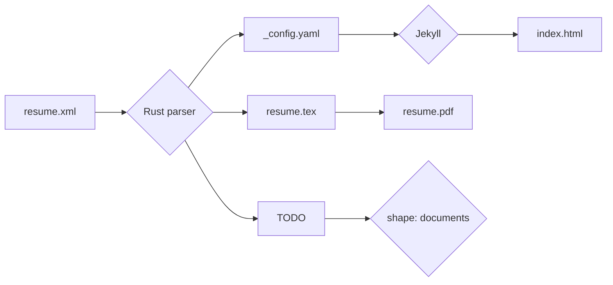

# cdemonchy
main access to public online project

## CV

Template from https://github.com/sproogen/modern-resume-theme
deployed on https://cdemonchy.com/

### local run

```bash
cd resume
docker compose up --build
```

Open your browser to http://localhost:4000

## Blog

### Run docusaurus locally

```bash
cd blog/website
npm start
```

### Build docusaurus

```bash
cd blog/website
npm run build
```

# Workflow



# TODO

[x] Convert yaml to xml file
[x] Validate XML
[] Ask for correction on english
[x] read and parse using serde-xml-rs
[x] yaml for Jekyl
[] latex -> pdf
[] update cv on other plateforms