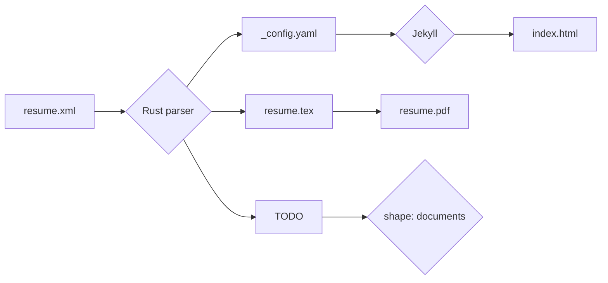

# cdemonchy
main access to public online project

## Requisite

Install [docker](https://www.docker.com/get-started/)
Install [npm](https://www.npmjs.com/)
To run commands install [just](https://github.com/casey/just)

## CV

Template from https://github.com/sproogen/modern-resume-theme
deployed on https://cdemonchy.com/

### local run

```bash
just website_run
```

Open your browser to http://localhost:4000

## Blog

### Install dependencies

Run only once

```bash
just docusaurus_install
```

### Build blog

```bash
just blog_build
```

### Run blog locally

```bash
just blog_run
```

# Workflow


```mermaid
flowchart LR

A[resume.xml] --> B{Rust parser}
B --> C[_config.yaml] 
C --> J{Jekyll} 
J --> S[index.html] 
B --> L[resume.tex] --> P[resume.pdf] 
B --> t[TODO] --> Marketplace{shape: documents }
```

# TODO

[x] Convert yaml to xml file
[x] Validate XML
[] Ask for correction on english
[x] read and parse using serde-xml-rs
[x] yaml for Jekyl
[] latex -> pdf
[] update cv on other plateforms
